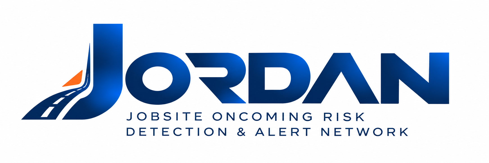
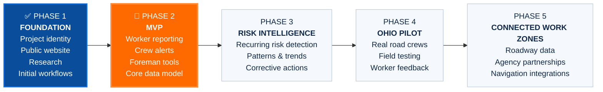
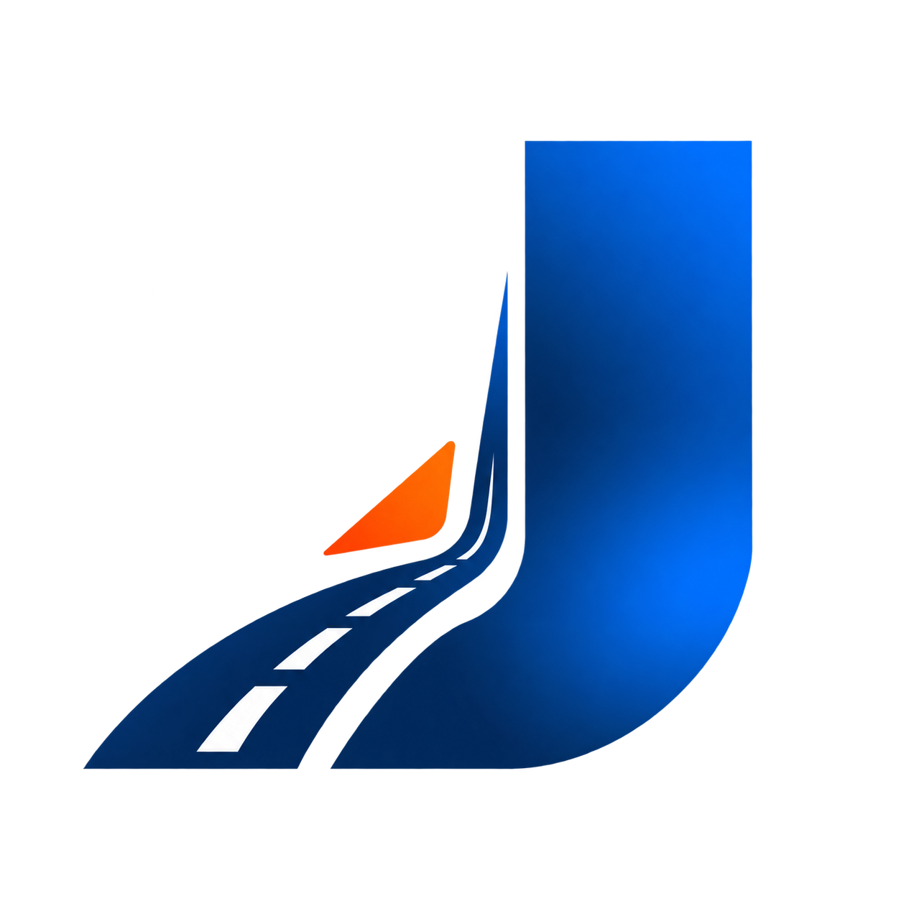

<div align="center">



<br>

# Project Jordan Thomas

### Building technology so more road workers make it home.

**In memory of Jordan Thomas • February 28, 2026 • Forever 25**

[Project Website](https://ProjectJordanThomas.com) · [Why JORDAN Exists](https://ProjectJordanThomas.com/why.html) · [Development Roadmap](https://ProjectJordanThomas.com/roadmap.html) · [Press](https://ProjectJordanThomas.com/press.html)

</div>

---

## Why This Exists

On February 28, 2026, **Jordan Thomas was killed by a reckless driver while working inside a closed construction zone on Interstate 70 in Columbus, Ohio.**

He was 25 years old.

Jordan was a son, a brother, a friend, a coworker, and a road worker.

He should have come home.

**Project Jordan Thomas** was created in his memory by his sister, **Kaylah (Kay) Freeman-Thomas**.

The project exists to turn grief into action through worker advocacy, public awareness, research, and the development of technology focused on protecting people working alongside America's roads.

> **Jordan deserved to come home. Every worker does.**

---

# JORDAN

<div align="center">

### **J**obsite **O**ncoming **R**isk **D**etection & **A**lert **N**etwork

</div>

**JORDAN** is the technology product being developed under Project Jordan Thomas.

It is being designed as a work-zone safety platform that helps crews communicate danger while there is still time to act.

The core idea is simple:

**A worker sees danger → reports it quickly → the right people know → patterns become visible → action gets documented.**

JORDAN is being designed to help road crews:

- **Report** hazards, dangerous drivers, vehicle intrusions, near misses, crashes, injuries, and unsafe conditions in seconds.
- **Alert** workers when an immediate threat affects their active work zone.
- **Give foremen context** about what their crews are seeing in the field.
- **Detect recurring risk** across time, location, project, and event type.
- **Track corrective action** so reports do not simply disappear into an app.
- **Create usable evidence** for safety leaders, management, agencies, and other people with the authority to act.

---

## The Principle Behind the Product

JORDAN is being built around one rule:

> **Every report should create an immediate safety function, a management action, an escalation path, or usable evidence.**

The person standing beside traffic should not become the data-entry clerk.

The product should do as much of the administrative work as possible so the worker can focus on staying safe.

That means JORDAN should eventually understand context such as:

- time
- GPS location
- project
- active crew
- work zone
- report history
- recurring hazards

The worker should only have to add what actually matters.

---

# Development Roadmap

The public roadmap is intentionally visible.

This project will not be developed behind a curtain and revealed when someone decides it is "finished."

The goal is to build in public, document decisions, listen to the people who actually work in road construction, and let real-world feedback change the product.



### Phase 1 · Foundation

**STATUS: COMPLETE**

The foundation establishes what Project Jordan Thomas is, what JORDAN is intended to become, and why the work matters.

Completed work includes:

- Project Jordan Thomas identity
- JORDAN product identity
- approved visual brand system
- public project website
- Jordan's story and project mission
- initial national and Ohio work-zone safety research
- press and advocacy archive
- initial product concept
- initial worker-to-action workflow
- development philosophy
- public roadmap
- public GitHub repository

---

### Phase 2 · MVP

**STATUS: CURRENT**

This is where JORDAN becomes software.

The first MVP is focused on proving the core safety workflow before attempting to build every possible feature.

Current development targets include:

- worker hazard reporting
- project and active-crew context
- immediate crew awareness
- foreman visibility
- project and crew management
- initial corrective-action workflow
- foundational application data model
- authentication and user roles
- report history
- initial risk-event structure

The MVP does **not** need to solve the entire work-zone safety problem.

It needs to be useful enough for one real crew to say:

> **Yes. This would help us.**

---

### Phase 3 · Risk Intelligence

Once individual reports exist, JORDAN should begin answering larger questions.

**Where is danger happening?**

**When is it happening?**

**Is the same problem happening again and again?**

Planned capabilities include:

- recurring-risk detection
- time-based patterns
- location-based patterns
- repeated dangerous-driver reports
- vehicle-intrusion trends
- near-miss clustering
- unresolved hazard tracking
- corrective-action history
- safety trend dashboards
- evidence generation

Individual field observations should become **situational awareness**.

---

### Phase 4 · Ohio Pilot

JORDAN begins in Ohio.

The goal of the first pilot is not scale.

The goal is truth.

Real road workers should be able to tell us:

- what is useful
- what is annoying
- what is too slow
- what is missing
- what they would actually use beside traffic
- what looks good in a demo but fails during a workday

The product should change based on those answers.

Planned pilot work includes:

- real road-crew testing
- foreman feedback
- worker usability testing
- field workflow observation
- report-quality analysis
- alert usefulness testing
- corrective-action validation
- MVP iteration

---

### Phase 5 · Connected Work Zones

If JORDAN proves useful at the crew level, the long-term vision becomes larger.

Potential future integrations include:

- public roadway data
- transportation-agency partnerships
- jurisdiction-aware routing
- work-zone data standards
- roadway incident feeds
- navigation ecosystems
- connected work-zone infrastructure
- expansion beyond Ohio

The vision is a connected safety network where useful information can move beyond a single worker, crew, or project when doing so can prevent harm.

---

## What We're Building First

The first JORDAN workflow is intentionally small:

```text
Worker sees danger
        ↓
Reports what happened
        ↓
JORDAN captures available context
        ↓
Crew / foreman gets the information
        ↓
Reports accumulate
        ↓
Recurring patterns become visible
        ↓
Someone takes action
        ↓
The action is documented
```

No data abyss.

A report should go somewhere.

---

## Current Project Status

| Area | Status |
|---|---|
| Project identity | ✅ Complete |
| JORDAN branding | ✅ Complete |
| Public website | ✅ Complete |
| Why / memorial story | ✅ Complete |
| Press archive | ✅ Complete |
| Initial safety research | ✅ Complete |
| Product concept | ✅ Complete |
| Public roadmap | ✅ Complete |
| MVP architecture | 🚧 In progress |
| Worker reporting workflow | 🚧 In progress |
| Crew alert workflow | 🚧 In progress |
| Foreman experience | 🚧 In progress |
| Core data model | 🚧 In progress |
| Risk intelligence | ⏳ Planned |
| Ohio pilot | ⏳ Planned |
| Connected work-zone integrations | 🔭 Future |

---

## Build in Public

This repository is intentionally public.

The goal is for workers, safety professionals, transportation agencies, technologists, potential partners, journalists, and anyone following Project Jordan Thomas to be able to see how JORDAN evolves.

That includes:

- source code
- roadmap progress
- architecture decisions
- feature development
- documentation
- research
- product assumptions
- changes made because of worker feedback

Development will not always be clean.

There will be experiments.

There will be ideas that do not work.

There will be features that change.

That is part of building the right thing.

---

## Repository Structure

```text
project-jordan-thomas/
│
├── assets/
│   ├── images/
│   │   ├── brand/
│   │   └── jordan/
│   └── video/
│
├── docs/
│
├── index.html
├── why.html
├── jordan.html
├── how-it-works.html
├── roadmap.html
├── press.html
├── about.html
│
├── styles.css
├── why.css
├── script.js
│
└── README.md
```

As development moves from the public website into the JORDAN application, this structure will expand.

---

## Brand

<div align="center">



</div>

The JORDAN visual identity incorporates:

- **Jordan blue**
- a roadway forming the J
- a restrained safety-orange accent
- work-zone and roadway geometry

The branding was created specifically for Project Jordan Thomas and JORDAN.

Approved brand assets are stored in:

```text
assets/images/brand/
```

Please do not recreate, distort, recolor, or modify the JORDAN marks.

---

## Press + Public Record

Jordan's family has continued speaking publicly about who he was, what happened to him, work-zone safety, accountability, and the need to protect roadway workers.

The Project Jordan Thomas website maintains a public archive of:

- television interviews
- news coverage
- legislative testimony
- community coverage
- public advocacy

**Press archive:**  
[ProjectJordanThomas.com/press.html](https://ProjectJordanThomas.com/press.html)

---

## Contributing / Project Feedback

JORDAN is still early in development.

The perspectives that matter most are from people who understand work zones firsthand.

That includes:

- road workers
- foremen
- superintendents
- safety professionals
- contractors
- transportation agencies
- roadway engineers
- work-zone researchers
- technologists

Formal contribution and pilot-interest workflows are still being developed.

Until then, development activity and product progress will remain visible through this repository and the public roadmap.

---

## Project Website

### [ProjectJordanThomas.com](https://ProjectJordanThomas.com)

The website includes:

- **Why** — Jordan's story and why this project exists
- **JORDAN** — the product vision
- **How It Works** — the proposed worker-to-action workflow
- **Roadmap** — the public development plan
- **Press** — interviews, reporting, testimony, and media resources
- **About** — the relationship between Project Jordan Thomas and JORDAN

---

## Created & Developed By

**Kaylah (Kay) Freeman-Thomas**

Project Jordan Thomas and JORDAN are being independently developed in memory of Jordan Thomas.

---

<div align="center">

### Jordan should be here.

### **Every road worker deserves to make it home.**


</div>